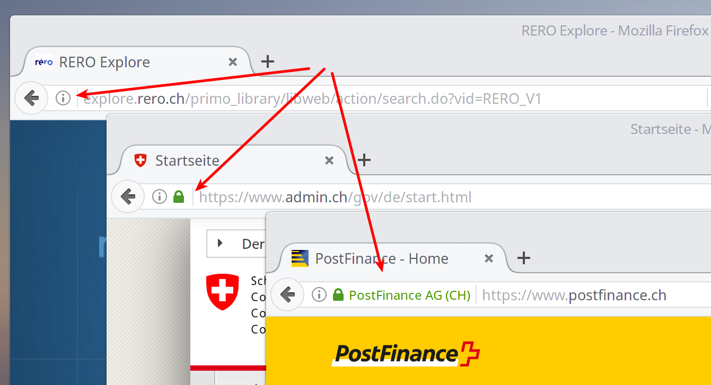

### Rappel de sécurité

La protection de vos données personnelles commence par le respect des quelques règles de sécurité rappelées ici.

1. **Mettez à jour les logiciels** (systèmes d'exploitation inclus) installés sur vos ordinateurs, smartphones et tablettes, afin de minimiser les risques que des pirates profitent d'une faille de sécurité;
   Cela paraît évident, mais sans cela ce qui suit devient inutile. Comme il n'est pas nécessaire que votre appareil prenne des décisions pour vous, n'activez pas les mises à jour automatiques. Sélectionnez plutôt l'option du type « m'avertir dès qu'une mise à jour est disponible ».

2. Choisissez des **mots de passe forts**: longs (12 caractères au minimum), sans signification ni basé sur des données publiques vous concernant (anniversaire d'un de vos proche), mélangeant lettres (majuscules et minuscules), chiffres et autres caractères, et différents pour chaque site ou service où vous avez un compte;

   Pour créer des mots de passe difficiles à casser, il y a plusieurs possibilités, notamment:   
   * À partir des initiales d'une phrase
   * À partir 4 mots sans lien les uns avec les autres
   * À l'aide d'un générateur de texte aléatoire
   * À l'aide d'un gestionnaire de mots de passe

3. Utilisez une **connexion sécurisée** lorsque vous surfez.

   Assurez-vous que les sites que vous visitez fournissent un accès sécurisé en vérifiant qu'il y a bien un cadenas dans la barre d'adresse de votre navigateur. Si ce n'est pas le cas, la capture d'écran ci-dessous vous le montre.

## À qui faites-vous confiance ?

La sécurité est la première couche de protection de vie privée. Sans elle, vous ne pouvez pas protéger efficacement des données personnelles, mais elle n'est pas suffisante à elle toute seule.   
Si vous vous connectez de manière sécurisée avec un mot de passe très robuste à partir de votre ordinateur à jour à un site qui vous demande de donner des informations personnelles et que vous le faites (Facebook par ex.), aucune mesure de sécurité ne peut vous protéger.   
De même, la présence du cadenas vert vous assure que la connection avec le site que vous visitez est chiffrée, mais cela ne vous empêche pas de vérifier si l'adresse de ce site semble normale et que ce site est bien celui qu'il prétend être.

Il faut donc appliquer une deuxième couche afin de faire respecter au mieux votre vie privée. Elle tient en une question:   
**Est-ce que je fais confiance à ce site ?**
